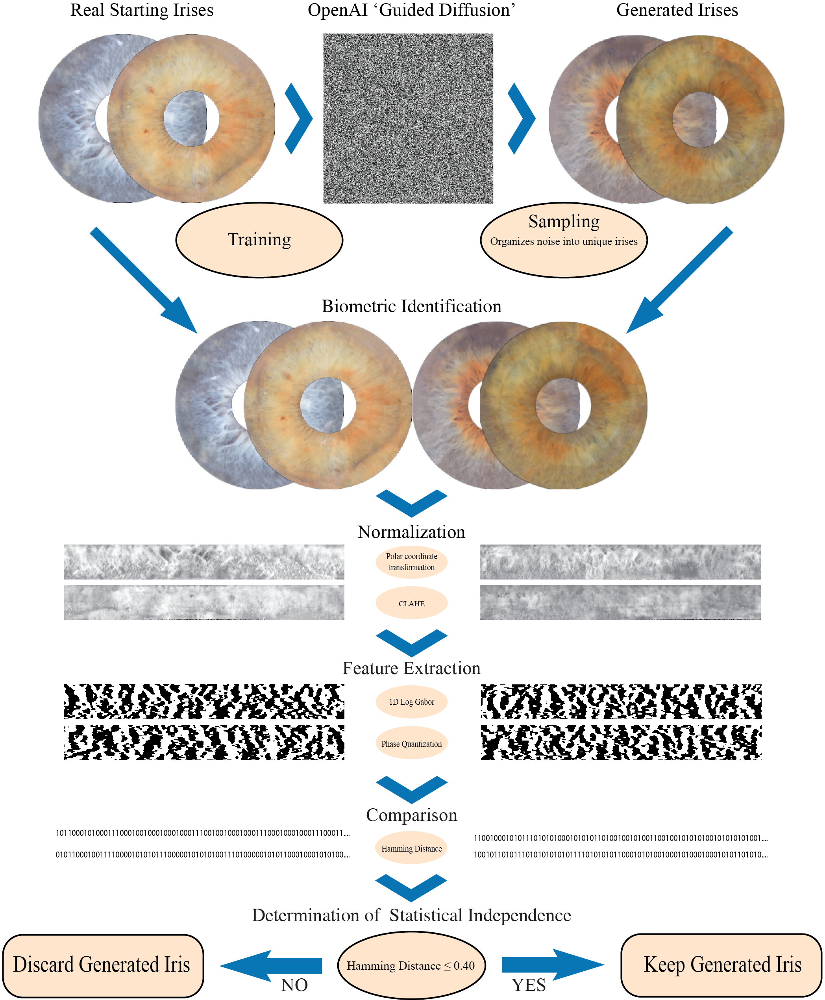

# Training a Diffusion Model to Create Biometrically Unique Iris Textures

# Descriptions of Included Sub-Modules
Two sub-modules are included in this repository. They are necessary for the replication of our results and are briefly described below.

 -   **OpenAI's 'Guided Diffusion'** 
		- The 'GuidedDiffusion' sub-module of this repository is our slightly modified fork of [OpenAI's 'Guided Diffusion' codebase](https://github.com/openai/guided-diffusion), which was prepared by OpenAI in conjunction with their paper: [Diffusion Models Beat GANS on Image Synthesis](http://arxiv.org/abs/2105.05233).
		- This fork contains small modifications and additions to the codebase such as to facilitate the reproduction of diffusion results reported by 'Training a Diffusion Model to Create Biometrically Unique Iris Textures'. It is necessary to install in order to replicate our methods of model training and sampling.
		- Bash scripts with our training parameters and sampling parameters can be found within the 'GuidedDiffusion' sub-module, and are called 'train.sh' and 'sample.sh', respectively. Before running these scripts, make sure to change file-paths and other parameters as instructed by each script's respective comments.

- **'iris-evaluation'**

	 - The 'iris-evaluation' sub-module of this repository is a custom Python package written to conduct biometric analysis of iris textures. The specific iris recognition technique utilized by 'iris-evaluation' is that of Libor Masek, who improved upon Daugman's early iris recognition work by replacing the use of 2D Gabor Filters for feature extraction with 1D Log-Gabor Filters. 
	 - 'iris-evaluation' utilizes a custom otsu threshold-based segmentation technique to separate concentric iris patterns from black backgrounds; Daugman's 'Rubber Sheet' model for normalization; and Hamming Distance to compare iris codes.
	 - More details can be found in 'Training a Diffusion Model to Create Biometrically Unique Iris Textures'. Here we provide the package's code here for the purposes of inspection and replication.
	 - **The 'iris-evaluation' Python package is only suitable for research purposes and provides a limited choice of methods for iris segmentation, iris normalization, feature extraction, and etc.**; however, it was designed such that other methods could be added as package modules in the future.
	 - 'iris-evaluation' utilizes PyTorch and thus performs best on devices with Apple Silicon or NVIDIA GPUs. Performance on other hardware may vary.

If you wish to install the contents of an individual sub-module by itself, instructions can be found within the respective sub-module.   

# Descriptions of Repository Directories

This repository has three directories of its own whose contents are described below: 

 - **dataset_tool**
	 - dataset_tool is a Python program that orchestrates modules from our 'iris-evaluation' package such as to seamlessly analyze and compare datasets of iris images. In other words, dataset_tool puts the contents of 'iris-evaluation' to work for the exact purposes of this paper in a way that is portable, human-readable, & repeatable.
	 - dataset_tool is packaged with a simple GUI to help get analyses started. Further, sample sets of generated irises are available for those who wish to see how we used dataset_tool to compare datasets of irises.
	 
 - **Notebooks**
	 - Rendered Juypter Notebooks of each analyses performed to generate paper figures.
	
 - **Scripts**
	 - Miscellaneous scripts used for various parts of our work. 

# Installation

Coming soon.

## Data Disclaimer

While our code is freely available, our data is inherently sensitive and is therefore kept private. However, data may be available upon request on a case-by-case basis.

